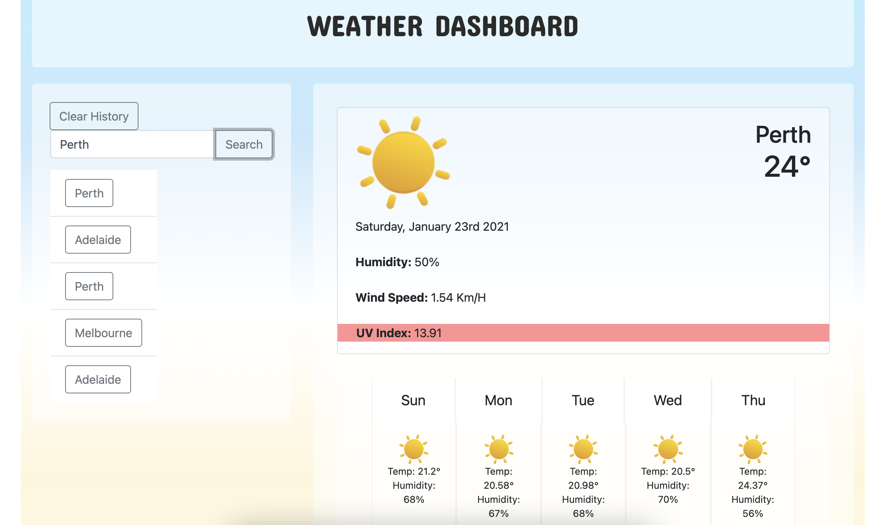

# Full-Stack Bootcamp - Week 6 Homework

## Weather Dashboard
The application was designed to provide the user with the current and 5-day forecast for the searched city. 
The search is then stored in the local storage for future use. 
The user is able to clear the past searches as well. 

## For Future Development
The integration of the prious searches being called when the item is clicked in the historical panel. 

## Deployed application
https://bellasantiago.github.io/weatherDashboard

## Github Repository
https://github.com/bellasantiago/weatherDashboard

## Finished Screenshots
